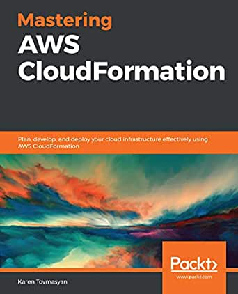

# Mastering-AWS-CloudFormation
Mastering AWS CloudFormation, published by Packt

## AWS 클라우드포메이션 마스터 (한국어판)
AWS 클라우드포메이션이란?
Infrastructure-as-Code의 구현도구이자 방법

* 출판사: 에이콘 http://acornpub.co.kr/
* 번역착수: 2020.10.02
* 역자: 동준상 ('AWS 솔루션스 아키텍트 올인원 스터디 가이드' 번역 / 에이콘, 2020.8)
* 역자 참조링크 (네이버책): https://book.naver.com/bookdb/book_detail.nhn?bid=16591667
* 역자 참조링크 (링크드인): https://www.linkedin.com/in/junsang-dong/

### AWS 클라우드포메이션 마스터 도움자료

* 유튜브 실습 플레이리스트 https://www.youtube.com/playlist?list=PLeLcvrwLe186Ubc_TMjNAFQHawujq9uFO
* 원서 상세정보 (팩트) https://www.packtpub.com/product/mastering-aws-cloudformation/9781789130935
* 원서 상세정보 (아마존) https://www.amazon.com/Mastering-AWS-CloudFormation-infrastructure-effectively/dp/178913093X
